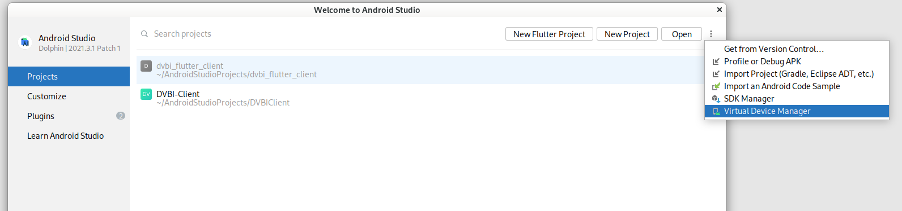
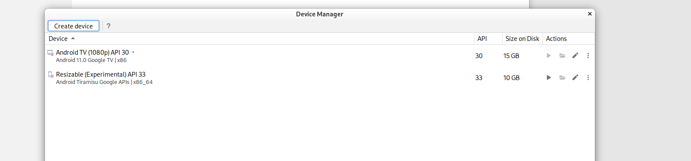
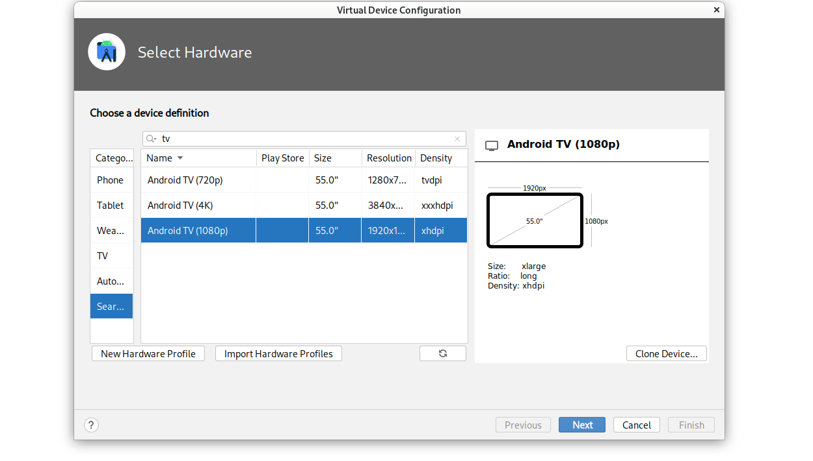
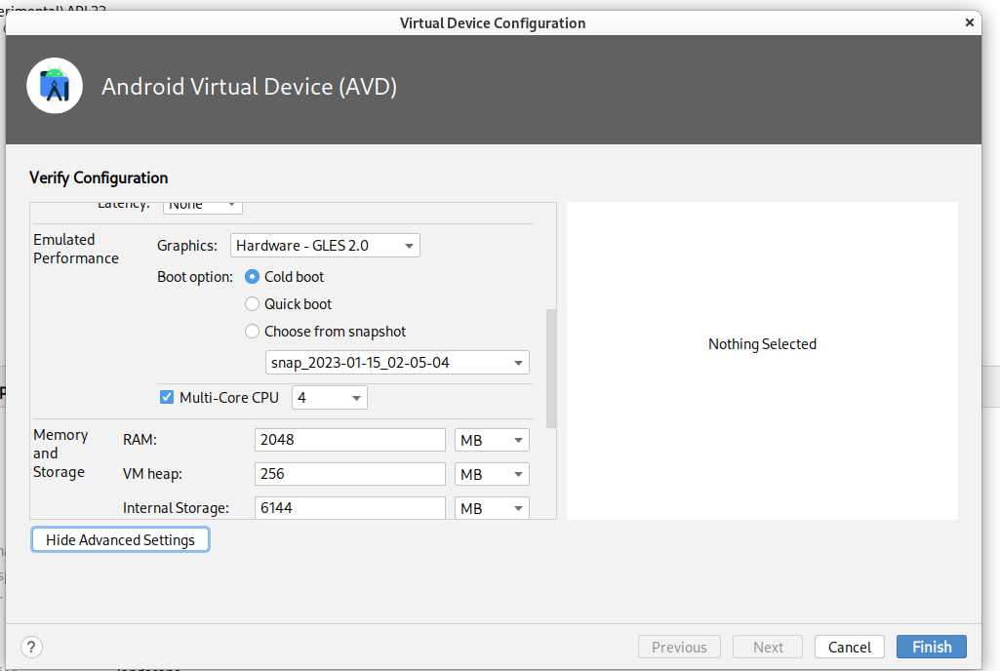
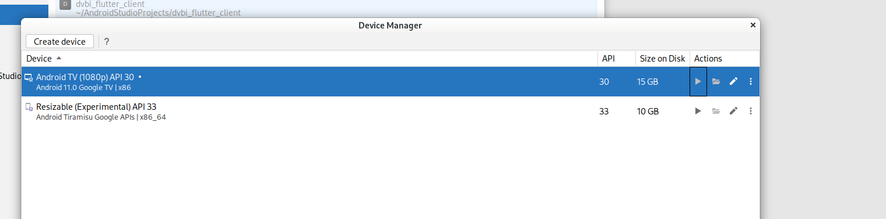
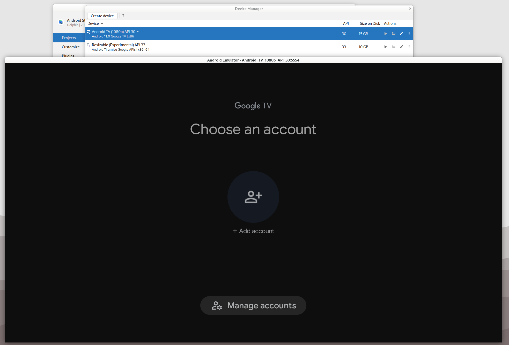

# Install dependencies

Clone the repository and go to the praxis3 folder:
```bash
git clone git@github.com:AWT-DVBI/dvbi_client.git dvbi_client && cd dvbi_client
```


Install the [Nix package manager](https://nixos.org/download.html) by executing following command:
```bash
sh <(curl -L https://nixos.org/nix/install) --daemon --yes --nix-extra-conf-file ./nix.conf && bash
```


# Build App 
Drop into dev shell environment with pinned dependencies regardles of Linux distribution by executing:
```bash
nix develop
```

## Code editor

Afterwards open a ready to use vscodium for the project:
```
code .
```


## Build an APK for android
```
cd dvbi_client && flutter build apk
```

The resultik apk can be then found under: `build/app/outputs/flutter-apk/app-release.apk`

## Build and run in emulator
Install [Android Studio](https://developer.android.com/studio)
and launch it. Then click on the three dots and select `Virtual Device Manager`.



A new window should pop up. On the left hand side there should be a button labeled "Create device". Click it.



A new windows should pop up. Select the Android TV (1080p) device and click on `next` in the lower right corner.



Then in the new pane click on `Show Advanced Settings` and edit the RAM option to be `2048 MB` and the VM heap RAM to be `256 MB`. Set the core count to `4` to make emulation faster. Afterwards click on `Finish` on the lower right corner.



You should be back in the previous window with a new entry titled Android TV (1080p) API 30. Click on the
play icon next to it.



The emulator should now pop up like seen below.




Now go into the `dvbi_client/dvbi_client` directory and execute:
```
$ flutter devices
3 connected devices:

AOSP TV on x86 (mobile) • emulator-5554 • android-x86    • Android 11 (API 30) (emulator)
Linux (desktop)         • linux         • linux-x64      • NixOS 22.11 (Raccoon) 5.15.86
Chrome (web)            • chrome        • web-javascript • Chromium 107.0.5304.87
```

You should see 3 targets one of them should be titled AOSP TV on x86 (mobile). This is the emulator.

To now run the application on the emulator execute:
```
flutter run -d emulator-5554
```
Replace the `emulator-5554` with whatever the command `flutter devices` shows in the second column of `AOSP TV on x86 (mobile)`.


You can also use an actual Android device. Just set the phone into `Developer` mode and connect it to the computer via usb. Also make sure to have Android ADB installed and running. `flutter devices` should then list it as a new target. 